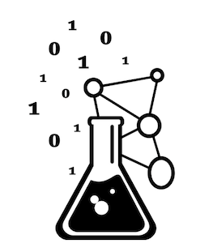
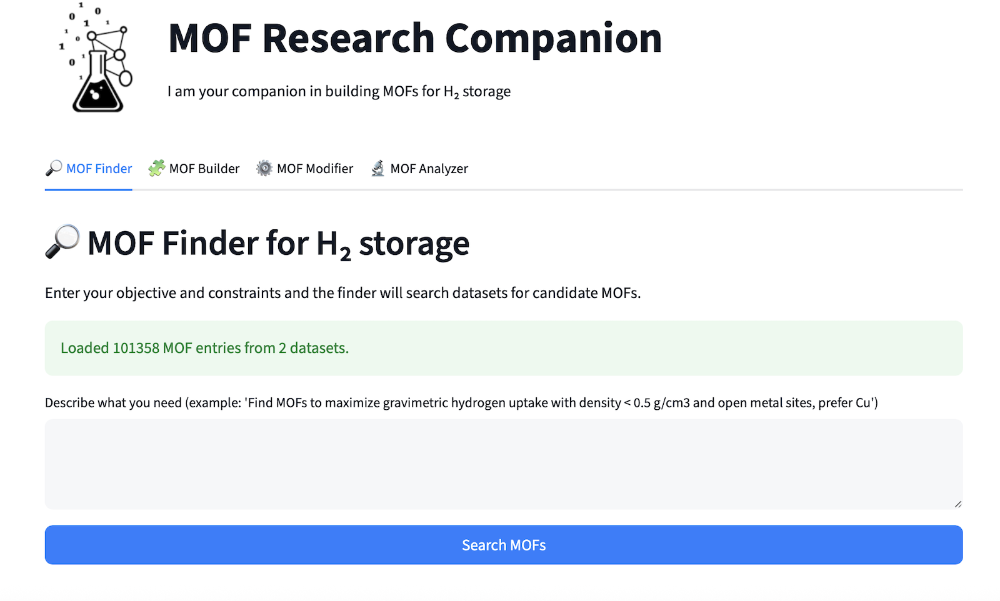
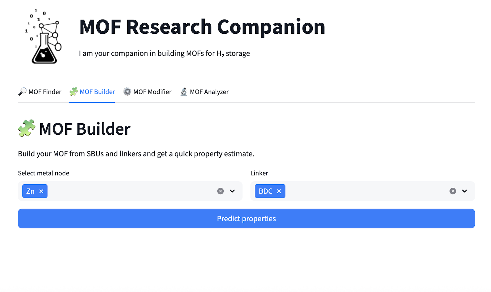
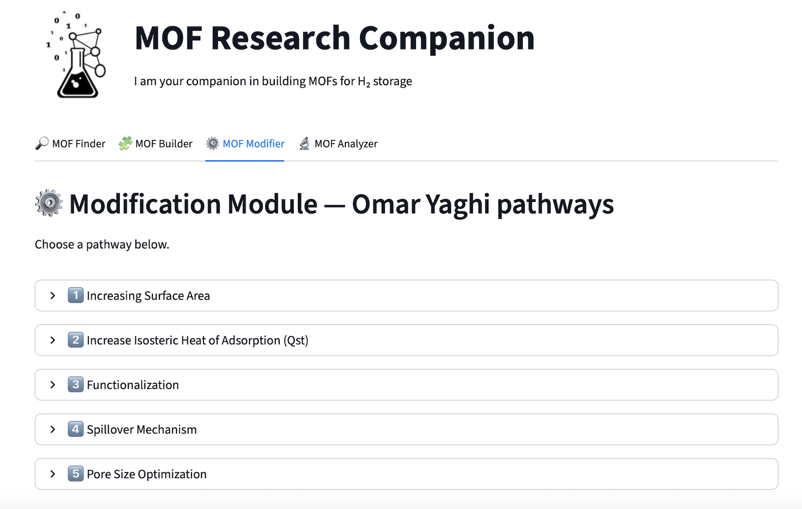
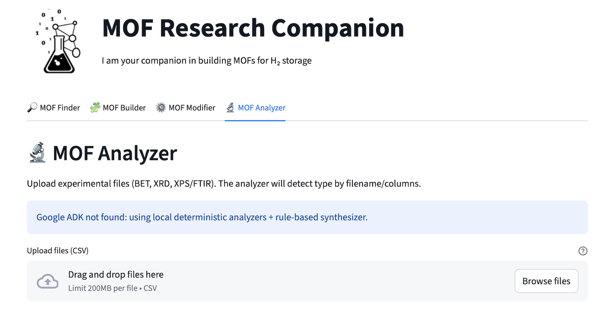

# AI-Driven MOF Research Companion for H₂ Storage


<p align="center">
  
</p>

### 🔬 Project Overview

The AI-Driven MOF Research Companion is a unified platform designed to accelerate end-to-end MOF discovery workflows for H₂ storage.

### 🎯 Objectives

- Build an AI-driven multi-agent system that accelerates the entire MOF research pipeline for H₂ storage.
- Predict pore architecture, topology, hydrogen uptake, Qst, and stability before synthesis.
- Suggest feasible designs based on available ligands and metals.
- Recommend best pre-, in-situ-, and post-synthetic modification strategies.
- Automate characterization interpretation across XRD, BET, SEM/TEM, XPS, IR, UV-Vis.
- Identify the dominant hydrogen storage mechanism and how to improve it.


### 🧠 System Architecture
The system uses a multi-agent AI framework supported by established MOF datasets such as CoRE and HyMARC. Each agent corresponds to a key step in MOF research.
- **MOF Finder:** Retrieves hydrogen-storage-relevant MOFs from major datasets and extracts structural and adsorption properties including pore metrics, surface area, Qst, open-metal sites, and reported uptake. Uses ranking algorithms based on user temperature and pressure conditions.

<p align="center">
  
</p>

- **MOF Builder:** Identifies MOF structures that can be formed from user-provided ligands and metal nodes. Predicts topology, pore characteristics, coordination environment, and stability. Generates preliminary structural models for candidate materials.

<p align="center">
  
</p>

- **MOF Modifier:** Applies predictive models to evaluate functionalization, linker extension, metal substitution, OMS creation, and spillover pathways. Estimates changes in hydrogen uptake, Qst, pore architecture, and stability. Can interface with simulation tools for validation.

<p align="center">
  
</p>

- **MOF Analyzer:** Processes characterization data including XRD, BET, SEM and TEM, XPS, and IR. Performs peak extraction, pore analysis, structural assessment, and functional-group identification. Predicts the dominant hydrogen storage mechanism and how we can enhance it.

<p align="center">
  
</p>


### 🛠️ Installation

   ```
   $ git clone https://github.com/LailaMB/mof-research-companion.git
   $ cd mof-research-companion

   $ python3 -m venv venv
   $ source venv/bin/activate
   $ pip install -r requirements.txt

   $ streamlit run streamlit_app.py
   ```


### 👥 Contibutors
- Nojoud Alharbi
- Laila Bashmal
- Shahad Alkamli